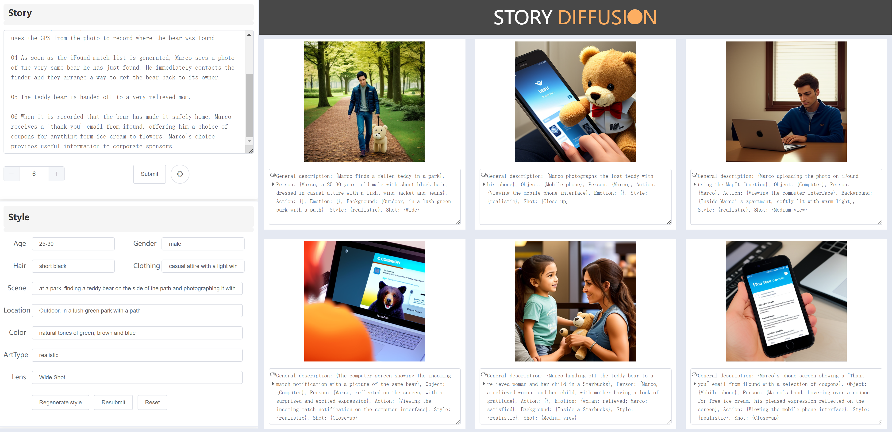

# Storyboard_Diffusion

A web tool called StoryDiffusion, which enables collaborative storyboard creation between human and computer, through natural language input and automatic storyboard generation.

The project requires more than 12g of RAM and more than 8g of video memory as well as better hardware performance for a full run, so it is not recommended to run it on low-computing-power devices such as personal laptops.

## Stable Diffusion
Develop based on https://github.com/AUTOMATIC1111/stable-diffusion-webui, thanks for their amazing work.

Install
for Windows users
run webui-user.bat (python installation needed)


Download the model from https://civitai.com/models/4823/deliberate, and put it into 'stable-diffusion-webui/models/Stable-diffusion'


Optional model:
```
{ value: 'AnimalSketch.ckpt [77d8250fbb]', label: 'AnimalSketch' },
{ value: 'AnythingV5_v5PrtRE.safetensors [7f96a1a9ca]', label: 'AnythingV5_v5PrtRE' },
{ value: 'beautifulRealistic_brav5.safetensors', label: 'beautifulRealistic_brav5' },
{ value: 'cyberrealistic_v30.safetensors', label: 'cyberrealistic_v30' },
{ value: 'deliberate_v2.safetensors', label: 'deliberate_v2' },
{ value: 'disneyPixarCartoon_v10.safetensors', label: 'disneyPixarCartoon_v10' },
{ value: 'dynavisionXLAllInOneStylized_alpha036FP16Bakedvae.safetensors [2797fe9939]', label: 'dynavisionXLAllnOneStylized' },//
{ value: 'majicmixRealistic_v5.safetensors', label: 'majicmixRealistic' },
{ value: 'meartsty.ckpt', label: 'meartsty' },
{ value: 'nextphoto_v20.safetensors', label: 'nextphoto_v20.safetensors' },
{ value: 'queratograySketch_v10.safetensors', label: 'queratograySketch_v10' },
{ value: 'samaritan3dCartoon_v10.safetensors', label: 'samaritan3dCartoon_v10' },
{ value: 'sd_xl_base_1.0.safetensors [31e35c80fc]', label: 'sd_xl_base_1.0' },
{ value: 'v1-5-pruned-emaonly.safetensors [6ce0161689]', label: 'v1-5-pruned-emaonly' },
{ value: 'v2-1_768-ema-pruned.ckpt', label: 'v2-1_768-ema-pruned' },
{ value: 'xsarchitecturalv3com_v31.ckpt', label: 'xsarchitecturalv3com' },
{ value: 'realisticVisionV51_v51VAE.safetensors', label: 'realisticVisionV51_v51VAE' },
```


Running
```
cd stable-diffusion-webui
venv/Scripts/python.exe launch.py --nowebui --xformers --no-half
```
(--no-half is optional if you do not have gpu with large vram)


## GPT4

```angular2html
pip install flask openai requests flask_cors
```
Write your OpenAI key in config.py

in flask_gpt4/style (Running on http://127.0.0.1:5000)
```
cd flask_gpt4/style
python style.py 
```
in flask_gpt4/transfer (Running on http://127.0.0.1:5001)
```
cd flask_gpt4/transfer
python transfer.py
```
in flask_gpt4 (Running on http://127.0.0.1:5010)
```
cd flask_gpt4
python prompt_edit.py 
```

## UI
Download and install node.js v15.14.0 from https://nodejs.org/es/blog/release/v15.14.0
```
cd sd_ui_vue
```

```
npm install
```

```
npm run serve
```

(Running on http://localhost:8080)


## Use

Open http://localhost:8080 in the browser.